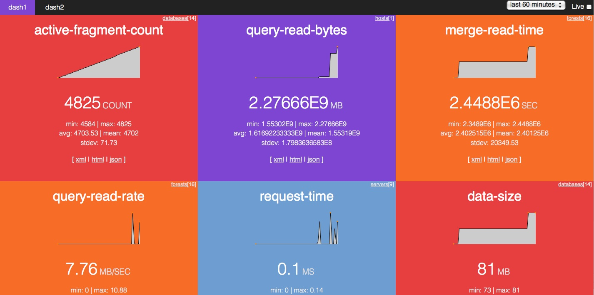

# dashML v0.1

[MarkLogic 7.0](http://developer.marklogic.com) introduces more tools for monitoring the performance of your MarkLogic server. dashML leverages these tools to make it easy to create lightweight, responsive dashboards giving you up-to-date information on the health and performance of your applications.

dashML provides a tabbed interface of metrics, which you can view on your smart phone, tablet or any browser. 
 

## Requirements

[MarkLogic 7.0](http://developer.marklogic.com) (latest version)

## To install

First, you need to download and install MarkLogic 7.

Second, create an appserver, providing the following details;

* **root**: provide directory where dashml/src/xquery was copied to your filesystem
* **port**: choose a port ####
* **set database**: set to Meters database
* **set error handler**: /rxq-rewriter.xqy?mode=error
* **set rewrite handler**: /rxq-rewriter.xqy?mode=rewrite

If you are installing on a brand new ML7 instance, you may have to wait a little while to give a chance for some metrics to be collected before building (and viewing) dashboards.

With everything setup, you can now point your web browser to http://localhost:####  (where ### is the port number you choose when setting up appserver) and you should see dashML homepage.

Click onto instructions tab or go direct to building dashboards.

## Using dashML

Just goto http://localhost:####/instructions

## To install/run tests

create an appserver, providing the following details;

* **root**: provide directory where dashml/src ison your filesystem
* **port**: choose a port ####
* **set database**: set to Meters database

Now point your web browser to http://localhost:####/xray which will run all tests

## FAQ

* 'X is not working' - make sure you have run long enough for meters to be generated (or switch to last 60 minutes)
* submit an [issue](https://github.com/xquery/dashML/issues)

## TODO

some thoughts on future features

* make widgets and dash standalone (consume json endpoints)
* add resource selection
* different widget types
* add replica to database
* customise everything (colors, etc)
* reordering
* add thresholds for alerting
* add start & end selection

## Caveat Emptor

* I made GET do bad things (as in not idempotent)
* time constraints = quick code generate (though there are some xray unit tests)
* no error checking (other then schema validation)
* probably a long list of other things done poorly ...

## License

dashML is released under Apache License, Version 2.0

## More Info on technologies

The following are links on the other technologies used in this application.

* RXQ github [repository](https://github.com/xquery/rxq).
* [purecss](http://purecss.io/) - css templates
* [EXQuery RESTXQ Draft Specification](http://exquery.github.com/exquery/exquery-restxq-specification/restxq-1.0-specification.html#method-annotation).
* Adam Retter's [RESTXQ](http://archive.xmlprague.cz/2012/presentations/RESTful_XQuery.pdf).
* [JSR-311](http://download.oracle.com/otndocs/jcp/jaxrs-1.0-fr-eval-oth-JSpec/).
 
The usage of RESTXQ annotations turns out to be a very concise way of building up flexible RESTFul interfaces, as well as providing the basis from which to create MVC architectures for our XQuery web applications.
